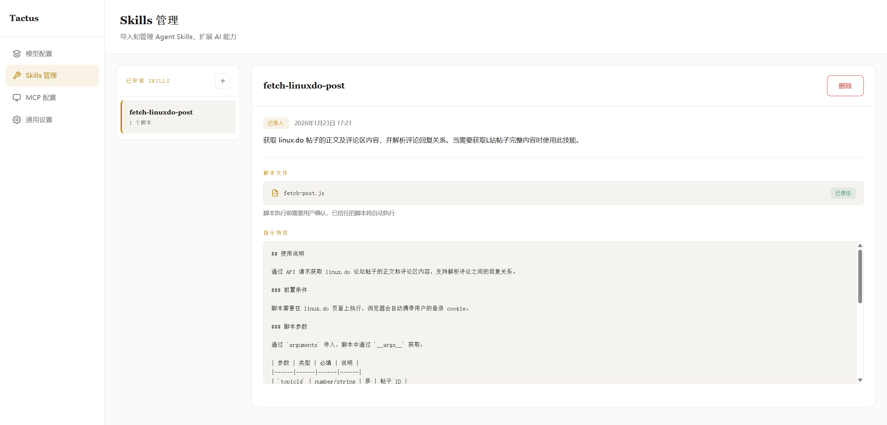
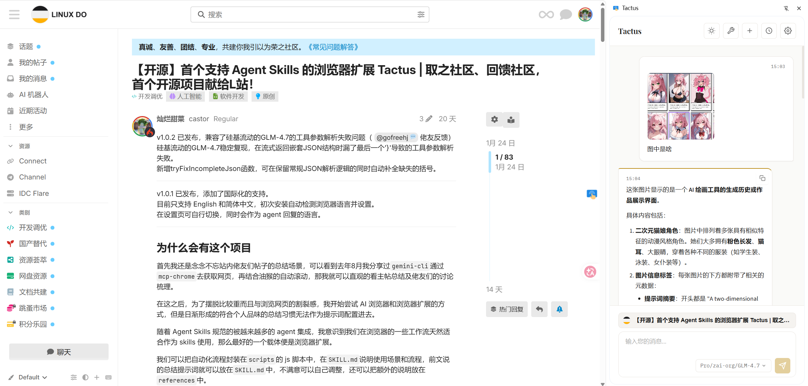
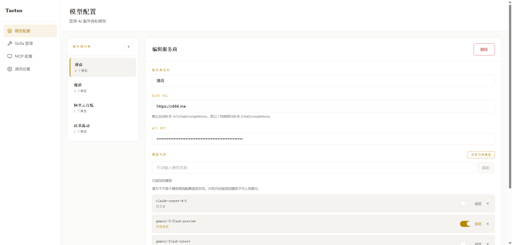

English | [简体中文](README_ch.md)

#  Tactus

**The First Browser AI Agent Extension with Agent Skills Support**

Tactus is an innovative browser extension that brings the [Agent Skills](https://agentskills.io/specification) specification to the browser environment, enabling AI Agent to perform complex tasks through an extensible skill system.

Triggering skills can achieve prompt injection for specific scenarios, and common workflows can be encapsulated in scripts for execution, replacing repetitive automated operations of AI Agents. This approach is both fast and token-efficient.

<!-- Demo GIF  -->


## ✨ Core Features

### 🧩 Agent Skills System

Tactus is the first product to implement the Agent Skills specification in a browser extension:

- **Skill Import** - Import spec-compliant Skill folders containing instructions, scripts, and resource files
- **Script Execution** - Safely execute JavaScript scripts within pages
- **Trust Mechanism** - First-time script execution requires user confirmation, with option to permanently trust

<!-- Skills Import Demo  -->


### 🤖 Intelligent Conversation

- **OpenAI Compatible API** - Supports any OpenAI-compatible API provider (including domestic model services)
- **Multi-Model Switching** - Configure multiple providers and switch models anytime
- **Streaming Response** - Real-time AI replies with chain-of-thought display
- **ReAct Paradigm** - Built-in complete tool calling loop, AI autonomously decides when to use tools
- **Stop Generation** - Interrupt ongoing AI generation or tool calls at any time

### 🖼️ Image Vision Support

- **Vision Model Config** - Configure vision capability independently per model
- **Paste Images** - Paste images directly in the chat input to send to AI
- **Multimodal Chat** - Support image-text mixed queries, letting AI understand screenshots, charts, and other visual content

<!-- Vision Demo  -->


### 📄 Page Understanding

- **Smart Extraction** - Uses Readability + Turndown to extract core page content and convert to Markdown
- **Selection Quote** - Select text on page or in sidebar and quote it with one click
- **Context Awareness** - AI determines whether to call page extraction tool; skips if skill script provides content
- **Raw Extraction Mode** - Configure specific websites to skip Readability algorithm and extract raw page content directly

<!-- Page Interaction Demo  -->


### 🔌 HTTP MCP Support

Connect to external tool servers via [Model Context Protocol](https://modelcontextprotocol.io/), extending AI capabilities:

- **MCP Server Connection** - Add and manage multiple HTTP MCP Servers
- **Dynamic Tool Discovery** - Automatically fetch available tools from MCP Server and integrate into conversations
- **Multiple Auth Methods**:
  - No authentication (public services)
  - Bearer Token authentication
  - OAuth 2.1 authentication (with auto-refresh)

<!-- MCP Config Demo  -->
https://github.com/user-attachments/assets/c7737e7e-dd2e-4888-a030-db40b9731f1d

### 🎨 Themes & Personalization

- **Theme Switching** - Support light, dark, and system-follow theme modes
- **Floating Ball Toggle** - Freely enable/disable the floating ball on the right side of the page
- **Selection Quote Toggle** - Freely enable/disable the selection quote feature
- **Internationalization** - Support Chinese/English interface switching

### 💾 Local Storage

- **Session Management** - Conversation history stored locally with pagination support
- **Message Editing** - Edit sent user messages and regenerate replies
- **Message Copy** - One-click copy for AI replies
- **IndexedDB** - Skills and files stored in local database
- **Privacy First** - All data saved locally, nothing uploaded to any server

### ⚙️ Advanced Configuration

- **Web Content Char Limit** - Configure maximum characters for extracted page content to control token usage
- **Tool Call Limit** - Configure maximum tool calls per conversation to prevent infinite loops
- **Smart Base URL Handling** - Auto-complete `/v1/chat/completions` path to simplify API configuration

## 🚀 Quick Start

### 1. Download
Download the latest `tactus.zip` file from the official GitHub [Releases page](https://github.com/Castor6/tactus/releases).

### 2. Install
- Extract `tactus.zip` to a permanent directory
- Open `chrome://extensions/` in Chrome
- Enable `Developer mode` (top right)
- Click `Load unpacked` (top left)
- Select the extracted `tactus` folder

## 🛠️ Build from Source

1. Clone the repository
```bash
git clone https://github.com/Castor6/tactus.git
cd tactus
```

2. Install dependencies
```bash
npm install
```

3. Run in development mode
```bash
npm run dev
```

4. Build for production
```bash
npm run build
```

5. Please use the Professional style within the `.claude\skills\design-style` skills to design with a unified extended UI style.

## 📖 User Guide

### Configure AI Provider

1. Click the extension icon to open the sidebar
2. Click the settings button to enter configuration page
3. Add API provider (fill in name, API URL, key)
4. Fetch model list and select a model
5. Enable vision config in model settings if vision capability is needed

<!-- Configuration Demo  -->


### Import Skill

1. Find the Skills management area in settings page
2. Click "Import Skill" button
3. Select a folder containing `SKILL.md`
4. Confirm import and use it in conversations

### Configure MCP Server

1. Find the MCP management area in settings page
2. Click to add an MCP Server
3. Fill in Server URL and select authentication method
4. Once connected, tools provided by MCP will be automatically integrated into conversations

### Skill Folder Structure

```
my-skill/
├── SKILL.md          # Required: Skill definition and instructions
├── scripts/          # Optional: Executable scripts
│   └── fetch-data.js
├── references/       # Optional: Reference documents
│   └── api-docs.md
└── assets/           # Optional: Resource files
    └── template.json
```

### SKILL.md Format

```markdown
---
name: my-skill
description: This is an example skill
---

# Skill Instructions

When user needs to perform a task, follow these steps:

1. First analyze user requirements
2. Call scripts/fetch-data.js to fetch data
3. Organize and return results
```

## 🛠️ Tech Stack

- **Framework**: [WXT](https://wxt.dev/) - Modern browser extension development framework
- **Frontend**: Vue 3 + TypeScript
- **AI Integration**: OpenAI SDK (compatible with any OpenAI API)
- **MCP Support**: @modelcontextprotocol/sdk - Model Context Protocol client
- **Content Extraction**: @mozilla/readability + turndown
- **Storage**: IndexedDB (idb) + WXT Storage
- **Authentication**: OAuth 2.1 support (for MCP Server auth)

## 🔧 Built-in Tools

Tactus provides the following built-in tools for AI:

| Tool | Description |
|------|-------------|
| `extract_page_content` | Extract main content from current page |
| `activate_skill` | Activate a specified Skill |
| `execute_skill_script` | Execute script within a Skill |
| `read_skill_file` | Read file content from a Skill |
| **MCP Tools** | Dynamically fetched tools from connected MCP Servers |

## 📝 Development

### Project Structure

```
tactus/
├── entrypoints/
│   ├── background.ts      # Background script
│   ├── content.ts         # Content script
│   ├── sidepanel/         # Sidebar UI
│   └── options/           # Settings page
├── components/            # Vue components
├── utils/
│   ├── api.ts             # API calls & tool execution
│   ├── db.ts              # IndexedDB operations
│   ├── storage.ts         # Settings & storage management
│   ├── i18n.ts            # Internationalization
│   ├── mcp.ts             # MCP Client management
│   ├── mcpOAuth.ts        # MCP OAuth 2.1 auth
│   ├── mcpStorage.ts      # MCP config storage
│   ├── skills.ts          # Skills core logic
│   ├── skillsExecutor.ts  # Script executor
│   ├── skillsImporter.ts  # Skills import
│   ├── tools.ts           # Tool definitions
│   └── pageExtractor.ts   # Page content extraction
└── public/                # Static assets
```

## 🤝 Contributing

Issues and Pull Requests are welcome!

## 🚧 Future Roadmap

We have exciting plans for the future development of Tactus:
- [ ] Introduce CDP automation as a tool for the Agent, allowing manual intervention and takeover.
- [ ] Record operations and generate reusable skills with a single click.
- [ ] Tackle the challenges of long-term stable automation tasks.

## 📄 License

Apache-2.0 License

## ⭐ Star History

[](https://star-history.com/#Castor6/tactus&Date)

---

**Tactus** - granting AI the sense of touch to navigate the web 🚀

